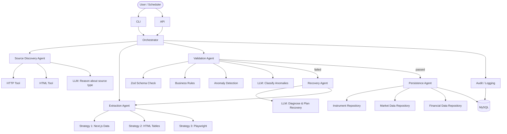

# DSE Agentic Scraper

An agentic, self-healing instrument data ingestion platform for the Dhaka Stock Exchange (DSE).

Built with Node.js, Express, Knex (MySQL), and an LLM-assisted workflow that can discover data sources, extract company data, validate it, recover from failures, and persist it reliably.

---

## Table of Contents

1. [Project Overview](#1-project-overview)
2. [Architecture](#2-architecture)
3. [Features](#3-features)
4. [Prerequisites](#4-prerequisites)
5. [Installation](#5-installation)
6. [Environment Configuration](#6-environment-configuration)
7. [MySQL Setup](#7-mysql-setup)
8. [Database Migrations](#8-database-migrations)
9. [LLM Configuration](#9-llm-configuration)
10. [Running the Application](#10-running-the-application)
11. [CLI Usage](#11-cli-usage)
12. [API Usage](#12-api-usage)
13. [Scraping Examples](#13-scraping-examples)
14. [Troubleshooting](#14-troubleshooting)
15. [Testing](#15-testing)
16. [Production Deployment](#16-production-deployment)
17. [Configuration Reference](#17-configuration-reference)
18. [Security](#18-security)
19. [Rate Limiting](#19-rate-limiting)
20. [Limitations](#20-limitations)
21. [Future Improvements](#21-future-improvements)

---

## 1. Project Overview

The DSE Agentic Scraper ingests instrument/company data from the Dhaka Stock Exchange website (`dse.com.bd`) using a multi-agent workflow.

Instead of a simple one-shot scraper, it uses:

- **Layered extraction strategies** — prefers structured data over fragile DOM scraping
- **Agentic recovery** — when extraction fails, an LLM diagnoses why and plans a recovery strategy
- **Business validation** — every value is validated before being stored
- **Anomaly detection** — large changes in key metrics are flagged and classified
- **Complete audit trail** — every run, error, and anomaly is recorded in the database

### Target Website

```
https://dse.com.bd/company/{SYMBOL}
```

Examples: `BATBC`, `GP`, `SQURPHARMA`, `BEXIMCO`

---

## 2. Architecture

### High-Level Flow



### Directory Structure

```
dse-agentic-scraper/
├── src/
│   ├── agents/
│   │   ├── orchestrator/        Workflow coordinator
│   │   ├── source-discovery/    Fetch + choose data source
│   │   ├── extraction/          Run extraction strategy
│   │   ├── validation/          Schema + business + anomaly checks
│   │   ├── recovery/            Diagnose failures, plan retry
│   │   ├── persistence/         Write validated data to DB
│   │   └── prompts/             LLM prompt files (.md)
│   │
│   ├── tools/
│   │   ├── http/                Axios wrapper with retry/backoff
│   │   ├── browser/             Playwright abstraction
│   │   ├── html/                Cheerio-based HTML parser
│   │   └── dse/                 DSE-specific URL + fetch helpers
│   │
│   ├── extraction/
│   │   ├── strategies/          nextjsData / html / playwright
│   │   ├── normalizers/         String, number, date, % normalizers
│   │   └── schemas/             Zod schemas for all data shapes
│   │
│   ├── validation/              Business rules (deterministic)
│   ├── repositories/            DB access layer (Knex, no raw SQL)
│   │
│   ├── database/
│   │   ├── migrations/          Knex migration files
│   │   ├── knex.js              DB connection singleton
│   │   └── migrate.js           Migration CLI runner
│   │
│   ├── providers/llm/           LLM provider abstraction + implementations
│   ├── workflow/state/          ScrapingState (immutable state object)
│   ├── api/routes/              Express route handlers
│   ├── cli/                     CLI entry points
│   ├── config/                  Central config (reads .env)
│   ├── logging/                 Winston logger
│   └── app.js                   Express app bootstrap
│
├── tests/
│   ├── unit/                    Unit tests (no DB, no network)
│   └── fixtures/dse/            HTML/JSON fixtures for testing
│
├── docs/                        Additional documentation
├── .env.example                 Environment variable template
├── package.json
├── docker-compose.yml
├── README.md
└── TECHNICAL.md
```

### Extraction Strategy Priority

```
1. __NEXT_DATA__ JSON    → fastest, most reliable
        ↓ if empty
2. HTML table parsing    → requires rendered HTML
        ↓ if page is JS shell
3. Playwright browser    → renders JS, then uses strategy 2
        ↓ if all fail
4. Recovery Agent        → LLM diagnoses and replans
```

---

## 3. Features

| Feature | Description |
|---|---|
| Agentic workflow | Multi-agent state machine with recovery |
| Layered extraction | Prefers structured data over DOM scraping |
| Next.js aware | Reads `__NEXT_DATA__` when available |
| Playwright fallback | Headless browser for client-rendered pages |
| Data normalisation | Numbers, dates, %, currencies |
| Schema validation | Zod-based type checking |
| Business rules | Price sanity, ownership totals, EPS ranges |
| Anomaly detection | Flags suspicious changes vs previous data |
| LLM classification | OpenAI/OpenRouter classifies anomaly severity |
| Recovery agent | LLM diagnoses failures and replans |
| MySQL persistence | Knex ORM, PostgreSQL-ready |
| Idempotent upserts | Running same symbol twice is safe |
| Audit trail | Every run, error, anomaly stored in DB |
| Raw snapshots | HTML saved for debugging |
| REST API | POST scrape, GET instrument, GET run |
| CLI | `npm run scrape -- BATBC` |
| Configurable | All thresholds in `.env` |
| Respectful scraping | Delays, backoff, rate limit handling |

---

## 4. Prerequisites

| Requirement | Version |
|---|---|
| Node.js | 20 or higher |
| npm | 9 or higher |
| MySQL | 8.0 or higher |
| Playwright (optional) | Installed via npm |

Check your versions:

```bash
node --version
npm --version
mysql --version
```

You do **not** need an LLM API key to run in mock mode (development/testing).

---

## 5. Installation

### Clone and install

```bash
git clone <repo-url>
cd dse-agentic-scraper
npm install
```

### Install Playwright browsers (optional, for headless scraping)

```bash
npx playwright install chromium
```

You only need this if you want the Playwright fallback strategy to work.
For local development and testing, the HTML strategy is sufficient.

---

## 6. Environment Configuration

Copy the example file and fill in your values:

```bash
cp .env.example .env
```

Then edit `.env`:

```env
NODE_ENV=development
PORT=3000

# Database
DATABASE_HOST=localhost
DATABASE_PORT=3306
DATABASE_NAME=dse_agentic
DATABASE_USER=dse_user
DATABASE_PASSWORD=your_secure_password

# LLM (use "mock" for development without an API key)
LLM_PROVIDER=mock
LLM_MODEL=gpt-4o-mini
LLM_API_KEY=

# DSE
DSE_BASE_URL=https://dse.com.bd

# Scraping behaviour
REQUEST_TIMEOUT_MS=15000
REQUEST_DELAY_MS=1000
MAX_RETRIES=3
MAX_RECOVERY_ATTEMPTS=3

# Logging
LOG_LEVEL=info
```

> **Never commit `.env` to version control.** It is already in `.gitignore`.

---

## 7. MySQL Setup

### Create the database and user

Log in to MySQL as root:

```bash
mysql -u root -p
```

Then run:

```sql
CREATE DATABASE dse_agentic CHARACTER SET utf8mb4 COLLATE utf8mb4_unicode_ci;
CREATE USER 'dse_user'@'localhost' IDENTIFIED BY 'your_secure_password';
GRANT ALL PRIVILEGES ON dse_agentic.* TO 'dse_user'@'localhost';
FLUSH PRIVILEGES;
EXIT;
```

### Verify connection

```bash
mysql -u dse_user -p dse_agentic
```

---

## 8. Database Migrations

Run all pending migrations:

```bash
npm run db:migrate
```

Check migration status:

```bash
node src/database/migrate.js status
```

Rollback the last batch:

```bash
npm run db:rollback
```

### Tables created

| Table | Purpose |
|---|---|
| `instruments` | Master record per symbol (one row per company) |
| `instrument_market_data` | Latest price, volume, market cap |
| `instrument_financial_data` | EPS, NAV, P/E, dividends, capital structure |
| `instrument_listing_data` | Ownership percentages |
| `scraping_runs` | One row per scraping execution |
| `scraping_errors` | Error log per run |
| `scraping_anomalies` | Detected anomalies per run |
| `scraping_snapshots` | Raw HTML for debugging/replay |

---

## 9. LLM Configuration

The LLM is used for reasoning tasks only:

- Deciding which extraction source to use
- Classifying anomalies (normal / warning / critical)
- Planning recovery when extraction fails

### Development (no API key needed)

```env
LLM_PROVIDER=mock
```

The mock provider returns pre-configured responses. The system works fully without a real LLM — it falls back to deterministic rules.

### OpenAI

```env
LLM_PROVIDER=openai
LLM_MODEL=gpt-4o-mini
LLM_API_KEY=sk-...
```

### OpenRouter (access 100+ models)

```env
LLM_PROVIDER=openrouter
LLM_MODEL=openai/gpt-4o-mini
LLM_API_KEY=sk-or-...
LLM_API_BASE_URL=https://openrouter.ai/api/v1
```

---

## 10. Running the Application

### Development server (with file watching)

```bash
npm run dev
```

### Production

```bash
npm start
```

### With Docker

```bash
docker compose up
```

---

## 11. CLI Usage

### Scrape a single instrument

```bash
npm run scrape -- BATBC
npm run scrape -- GP
npm run scrape -- SQURPHARMA
```

### Options

```bash
npm run scrape -- BATBC --debug       # verbose logging
npm run scrape -- BATBC --no-browser  # disable Playwright
npm run scrape -- BATBC --force       # bypass duplicate detection
```

### Scrape all instruments in the database

```bash
npm run scrape:all
```

This reads all symbols from the `instruments` table and scrapes each one sequentially with a delay between requests.

### Run migrations

```bash
npm run db:migrate
npm run db:rollback
```

---

## 12. API Usage

### Start a scraping run

```http
POST /api/scrape/instrument
Content-Type: application/json

{
  "symbol": "BATBC"
}
```

Response:

```json
{
  "runId": "SCRAPE-20260928-A1B2C3D4",
  "symbol": "BATBC",
  "status": "completed",
  "recordsCreated": 4,
  "recordsUpdated": 0,
  "warnings": [],
  "errors": [],
  "recoveryAttempts": 0,
  "durationMs": 3421,
  "extractionStrategy": "playwright"
}
```

### Get run details

```http
GET /api/scrape/runs/SCRAPE-20260928-A1B2C3D4
```

### Get scraping history for a symbol

```http
GET /api/scrape/history/BATBC?limit=5
```

### Get instrument data

```http
GET /api/instruments/BATBC
```

Response:

```json
{
  "instrument": {
    "id": "...",
    "symbol": "BATBC",
    "company_name": "British American Tobacco Bangladesh Company Limited",
    "sector": "Food & Allied",
    "category": "A"
  },
  "marketData": {
    "last_trade_price": 680.4,
    "volume": 12450,
    ...
  },
  "financialData": {
    "eps": 68.45,
    "navps": 187.23,
    ...
  }
}
```

### List all instruments

```http
GET /api/instruments
```

### Health check

```http
GET /api/health
```

---

## 13. Scraping Examples

### Verify a single scrape in debug mode

```bash
npm run scrape -- BATBC --debug
```

You will see detailed logs for every step:
- HTTP fetch result
- Whether `__NEXT_DATA__` was found
- Which extraction strategy was selected
- Validation results
- Persistence outcome

### Test without touching the database

Set `LLM_PROVIDER=mock` and run without a DB connection — the orchestrator will fail gracefully at the persistence step and log the extracted data.

### Check what was extracted

```bash
# After a successful run:
curl http://localhost:3000/api/instruments/BATBC | jq .
```

---

## 14. Troubleshooting

### "Page does not appear to be rendered"

The DSE website returned a JavaScript shell. Playwright was not available or was disabled.

**Fix:** Install Playwright and make sure `DISABLE_PLAYWRIGHT=false`.

```bash
npx playwright install chromium
```

### "All extraction strategies failed"

No data could be extracted after all retries.

**Possible causes:**
- DSE website is down
- Rate limiting (try increasing `REQUEST_DELAY_MS`)
- Symbol does not exist (try the DSE website manually)
- Playwright needs updating (`npx playwright install`)

### "Database connection failed"

Check your `.env` database settings and make sure MySQL is running.

```bash
mysql -u dse_user -p dse_agentic -e "SELECT 1"
```

### "LLM output failed schema validation"

The LLM returned unexpected JSON. This is handled gracefully — the system falls back to deterministic rules. If this happens repeatedly, check your `LLM_MODEL` setting.

### Playwright fails on Windows

```bash
# Install required browser
npx playwright install chromium

# If corporate proxy is blocking downloads:
PLAYWRIGHT_DOWNLOAD_HOST=https://playwright.azureedge.net npx playwright install chromium
```

---

## 15. Testing

### Run all unit tests

```bash
npm test
```

### Run specific test files

```bash
node --test tests/unit/normalizers/valueNormalizer.test.js
node --test tests/unit/validators/businessRules.test.js
node --test tests/unit/normalizers/htmlStrategy.test.js
```

### Test coverage areas

| Area | Tests |
|---|---|
| Value normalizers | Numbers, dates, %, strings, integers |
| Business rules | Price sanity, ownership, EPS, face value |
| HTML extraction | Normal page, missing fields, JS shell |
| Next.js data extraction | Embedded `__NEXT_DATA__` |
| Workflow state | Transitions, errors, serialisation |

### Adding fixtures

Save HTML files in `tests/fixtures/dse/` and use them in tests:

```js
const html = fs.readFileSync('tests/fixtures/dse/my-fixture.html', 'utf8');
const result = extract(html, 'SYMBOL');
```

---

## 16. Production Deployment

### Environment

```env
NODE_ENV=production
LOG_LEVEL=warn
LOG_FORMAT=json
DISABLE_PLAYWRIGHT=false
PLAYWRIGHT_HEADLESS=true
```

### Process management

Use PM2 or Docker:

```bash
# PM2
npm install -g pm2
pm2 start src/app.js --name dse-scraper

# Docker
docker compose up -d
```

### Scheduled scraping

Add a cron job or use a scheduler service to call the API periodically:

```bash
# Cron: run at 4pm Bangladesh time (10am UTC), Sun–Thu
0 10 * * 0-4 cd /app && npm run scrape:all >> /var/log/dse-scraper.log 2>&1
```

### Snapshot retention

Old raw snapshots are large. Configure retention:

```env
SNAPSHOT_RETENTION_DAYS=7
```

---

## 17. Configuration Reference

| Variable | Default | Description |
|---|---|---|
| `NODE_ENV` | `development` | Environment |
| `PORT` | `3000` | HTTP server port |
| `DATABASE_CLIENT` | `mysql2` | `mysql2` or `pg` |
| `DATABASE_HOST` | `localhost` | DB host |
| `DATABASE_PORT` | `3306` | DB port |
| `DATABASE_NAME` | `dse_agentic` | DB name |
| `DATABASE_USER` | `root` | DB user |
| `DATABASE_PASSWORD` | _(empty)_ | DB password |
| `LLM_PROVIDER` | `mock` | `mock`, `openai`, `openrouter` |
| `LLM_MODEL` | `gpt-4o-mini` | Model name |
| `LLM_API_KEY` | _(empty)_ | API key |
| `DSE_BASE_URL` | `https://dse.com.bd` | DSE base URL |
| `REQUEST_TIMEOUT_MS` | `15000` | HTTP timeout |
| `REQUEST_DELAY_MS` | `1000` | Delay between requests |
| `MAX_RETRIES` | `3` | HTTP retry limit |
| `MAX_RECOVERY_ATTEMPTS` | `3` | Agent recovery limit |
| `MAX_CONCURRENCY` | `3` | (future) concurrent scrapes |
| `LOG_LEVEL` | `info` | `debug`, `info`, `warn`, `error` |
| `LOG_FORMAT` | `json` | `json` or `simple` |
| `SNAPSHOT_RETENTION_DAYS` | `30` | Days to keep raw snapshots |
| `DISABLE_PLAYWRIGHT` | `false` | Disable headless browser |
| `PLAYWRIGHT_HEADLESS` | `true` | Run browser headless |

---

## 18. Security

- All credentials are read from environment variables — never hardcoded
- Database queries use Knex parameterized queries — no SQL injection risk
- LLM output is validated against Zod schemas before use — no arbitrary code execution
- URL validation (`isDseUrl`) prevents SSRF from constructed URLs
- No LLM-generated SQL ever executes against the database
- API does not expose raw database passwords or LLM keys in responses

---

## 19. Rate Limiting

The system is designed to be a **respectful scraper**:

- Configurable delay between requests (`REQUEST_DELAY_MS`)
- Exponential backoff on errors
- Respects `Retry-After` headers on 429 responses
- Does not implement any mechanism to bypass anti-bot controls

Recommended settings for production:

```env
REQUEST_DELAY_MS=2000
MAX_RETRIES=3
REQUEST_TIMEOUT_MS=20000
```

---

## 20. Limitations

- **DSE website changes** — if DSE redesigns their page, selectors may need updating. The LLM-assisted recovery can handle minor changes automatically.
- **No official API** — DSE does not provide a public JSON API. All data is scraped.
- **Market hours** — data is only meaningful during or after trading hours.
- **Playwright requirement** — the current DSE website requires JavaScript rendering. Without Playwright, extraction succeeds only if `__NEXT_DATA__` is populated.
- **LLM quality** — anomaly classification depends on LLM response quality. With `mock` provider, all anomalies are treated as warnings.

---

## 21. Future Improvements

- **Scheduled scraping** — integrate a proper job scheduler (Bull, node-cron)
- **Admin UI** — React dashboard for viewing runs, anomalies, and data
- **More symbols** — auto-discover all listed DSE symbols
- **Historical data** — store time-series price data
- **PostgreSQL migration** — switch database client in `.env`
- **Notifications** — alert on critical anomalies via email/Slack
- **CSE support** — extend to Chittagong Stock Exchange
- **Distributed scraping** — multi-worker with Redis queue
